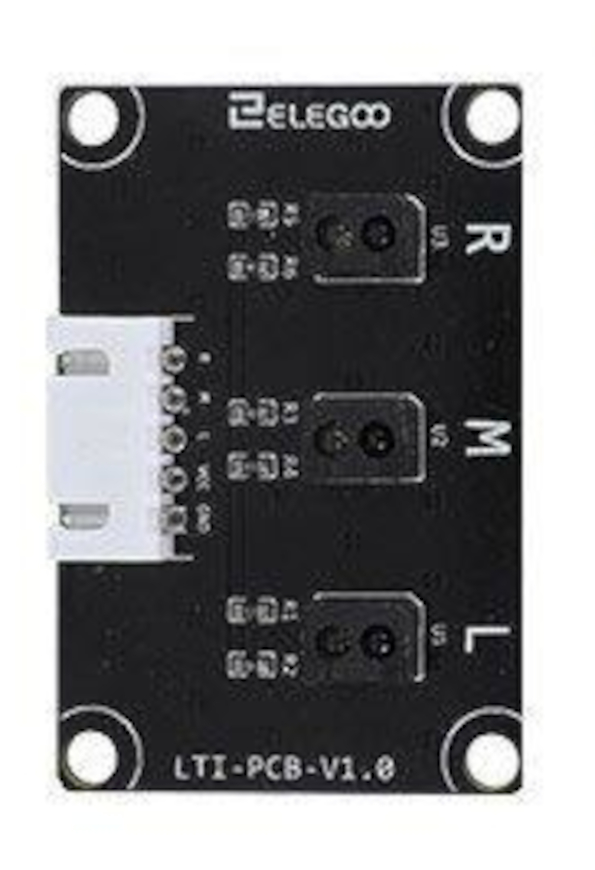

<center>
  
</center>

# Follow Line Robot

The follow line uses a 3 infrared sensor array wich are used to determine the position of the black line.

The robot should detect when its position changes and rectify to be on the most straight possible respectively to the line.

To configure the different tasks executed we used the FreeRTOS library wich acts like a scheduler for Arduino.

### Finite State Machine

To control the line follower we use a finite state machine which determines the next state through the readings of the three infrared sensors.These values ​​range from 0 to 1000, the value being higher the darker the line. This is the reasoning followed to resolve wich state is chosen. Each state is represented by a number:

* If the the middle sensor is the only one on the line, the state will be Forward or **STATE 1**. This state calls the function *forward()*.
* When the middle sensor and one of the laterals are there two options depending on which side the car came off. These state are 2 or 3, that are *left()* or *right()*. In these two *If-else* sentences we store the value of both laterals sensor to calculate the next state.
* In the case that no sensor is seeing the line there are two options again, depending wich sensor was the last wich was on the line. The functions called by this condiction are *lost_r()* and *lost_f()*
* There is a fourth condiction, but it is the one that is controlled by the ultrasonic sensor. All this condition and it's action will be explained in the comunication section.

```cpp
if (analogRead(PIN_ITR_MIDDLE) > 740 && analogRead(PIN_ITR_RIGHT) < 400 && analogRead(PIN_ITR_LEFT) < 400) {
  STATE = 1;
} 
else if(analogRead(PIN_ITR_RIGHT) > 650) { 
  error_r = analogRead(PIN_ITR_RIGHT);
  error_l = analogRead(PIN_ITR_LEFT);
  STATE = 2;            
}   
else if(analogRead(PIN_ITR_LEFT) > 650) {
  error_r = analogRead(PIN_ITR_RIGHT);
  error_l = analogRead(PIN_ITR_LEFT);
  STATE = 3;
}
else if (analogRead(PIN_ITR_MIDDLE) < 400 && analogRead(PIN_ITR_RIGHT) < 400 && analogRead(PIN_ITR_LEFT) < 400) {
  if (error_r > error_l) {
    STATE = 5;
  } else if (error_r < error_l) {
    STATE = 4;
  }
}

if (us_distance() < 10) {
  if (!printed_dist)
  {
    Serial.print("2;");
    Serial.print(String(us_distance()) +";");
    printed_dist = true;
  }
  STATE = 6;
}
```

To control all these states is used a *Switch-case* sentence. The cases have the same structure: a movement function is call and a message is send to de *ESP32* board depending wich *json* mesagge should be send. We use a *if* sentence in every case to to control that the message is only sent once. 
```cpp

[...]
case 1:
  forward();
  printed = false;
  if (printed_lost)
  {
    Serial.print("5;");
    printed_lost = false;
  }
  
  break;
[...]

case 6:
  lapTime = millis() - initTime;
  
  if (!printed)
  {
    Serial.print("1;");
    Serial.print(String(lapTime) + ";");
    printed = true;
  }
  stop();
  vTaskDelete(pingHandle);
  vTaskDelete(NULL);
  break;
```

### Movement

The movement functions use the PWM pins to selec the speed of each sid of the motors. The motors are controlled by differentiating left and right.

```cpp

void forward(){ 
  analogWrite(PIN_Motor_PWMA, 170);
  analogWrite(PIN_Motor_PWMB, 170);
  digitalWrite(PIN_Motor_A, HIGH);
  digitalWrite(PIN_Motor_B, HIGH);
  FastLED.showColor(Color(0, 255, 0));
}
 
void left() {
  digitalWrite(PIN_Motor_A, HIGH);
  digitalWrite(PIN_Motor_B, HIGH);
  analogWrite(PIN_Motor_PWMA, 135);
  analogWrite(PIN_Motor_PWMB, 70); 
  
  FastLED.showColor(Color(255, 255, 0));
}
```
For each function the LED included in the car glows with a color to indicate the state that is running in that moment.


(cortar y meter en comunicación)

### FreeRTOS

FreeRTOS is a market-leading real-time operating system (RTOS) for microcontrollers and small microprocessors. Using this system we have created two different Task, one to control the movement an other to send periodically a ping message every four seconds. Both tasks have the following structure:

```cpp
#define PERIODIC_IDLE 50
#define PING_IDLE 4000

[...]

void setup()
{
  [...]
  xTaskCreate(followLineCallBack, "follow_line", 128, NULL, 2, &followLineHandle);
  xTaskCreate(pingCallBack, "ping", 128, NULL, 1, &pingHandle );
  [...]
}

static void pingCallBack( void *pvParameters)  // This is a Task.
{
  TickType_t xLastWakeTime, aux;
  while (1)
  {
    xLastWakeTime = xTaskGetTickCount();

    while ( (aux - xLastWakeTime)*portTICK_PERIOD_MS < COMPUTATION_TIME_ON_T1) {
      aux = xTaskGetTickCount();
    }

    [task code]

  xTaskDelayUntil(&xLastWakeTime, (PING_IDLE/portTICK_PERIOD_MS));
  }
}

static void followLineCallBack( void *pvParameters)  // This is a Task.
{
  TickType_t xLastWakeTime, aux;
  while(1)
  {
    xLastWakeTime = xTaskGetTickCount();

    while ( (aux - xLastWakeTime)*portTICK_PERIOD_MS < COMPUTATION_TIME_ON_T2) {
      aux = xTaskGetTickCount();
    }

    [task code]

    xTaskDelayUntil(&xLastWakeTime, (PERIODIC_IDLE/portTICK_PERIOD_MS));
  }
}
```

The *ping* task will be explained in the next section.
