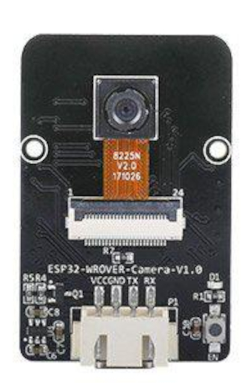

<center>
  
</center>

# Comunication
The comunications of the robot consists of two parts: the serial communication between the arduino and the esp32 and the MQTT messages sent by the esp32 via wifi.

### Serial communication
For this part both the arduino and the esp32 both send short messages to each other via the serial port. This is made by using the functions Serial.print() and Serial.read() on the arduino and Serial2.print() and Serial2.read() on the esp32. 
When the messages are received we process them using a buffer. When there is information to read, one character is saved in the buffer, then if that character is ';' then it means it is the end of the message so it can be process and at the end that character is added to the buffer.

```cpp
if (Serial2.available()) {

    char c = Serial2.read();
    
    if (c == ';')  {            
      [...]
      switch (sendBuff.toInt()) {
        [...]
      }

      [...]

      sendBuff = "";
    } else {
      sendBuff += c;
    }

  }
```

### MQTT
This is all made by the esp32. First it connects to a wifi network.
```cpp
void setup() {
  // Connect to WiFi access point.
  Serial.println(); Serial.println();
  Serial.print("Connecting to ");
  Serial.println(WLAN_SSID);

  WiFi.begin(WLAN_SSID, WLAN_PASS);
  while (WiFi.status() != WL_CONNECTED) {
    delay(500);
    Serial.print(".");
  }
  Serial.println();

  Serial.println("WiFi connected");
  Serial.println("IP address: "); Serial.println(WiFi.localIP());
}

void MQTT_connect() {
  int8_t ret;

  // Stop if already connected.
  if (mqtt.connected()) {
    return;
  }

  Serial.print("Connecting to MQTT... ");

  uint8_t retries = 3;
  while ((ret = mqtt.connect()) != 0) { // connect will return 0 for connected
       Serial.println(mqtt.connectErrorString(ret));
       Serial.println("Retrying MQTT connection in 5 seconds...");
       mqtt.disconnect();
       delay(5000);  // wait 5 seconds
       retries--;
       if (retries == 0) {
         // basically die and wait for WDT to reset me
         while (1);
       }
  }
  Serial.println("MQTT Connected!");
  Serial2.print("5");
  Serial.print("Messase sent! to Arduino");
}
```

Then it connects to a topic of the MQTT server.
```cpp
Adafruit_MQTT_Client mqtt(&client, AIO_SERVER, AIO_SERVERPORT);

Adafruit_MQTT_Publish topic_pub = Adafruit_MQTT_Publish(&mqtt, "/SETR/2023/15/");
```

To be able to send messages to the topic it must send them in json format. To send the json first it is created, then its fields are filled by the information that needs to be send, the json is serialized and it is published in the topic.
```cpp
StaticJsonDocument<capacity> jsonDoc;
[...]
      jsonDoc["team_name"] = "EstresaDittos";
      jsonDoc["id"] = "15";

      [...]

      char jsonString[capacity*2];
      serializeJson(jsonDoc, jsonString);

      Serial.print(F("\nSending json "));
      if (! topic_pub.publish(jsonString)) {
        Serial.println(F("Failed"));
      } else {
        Serial.println(F("OK!"));
      }
```

When distances or times are required in the message, whe add another field using the switch of the serial connection.
In order to send this numbers correctly we had to convert the data type of the buffer until they arrived to the topic correctly.
```cpp
          case 1:
          jsonDoc["action"] = "END_LAP";
          c = 'x';
          sendBuff = "";
          while(c != ';'){
            
            c = Serial2.read();
            if (c == ';')  {
              jsonDoc["time"] = sendBuff.toInt();
            } else {
              int intC = atoi(&c);
              sendBuff += intC;
              Serial.println(sendBuff);
            }
          }
          break;
```
