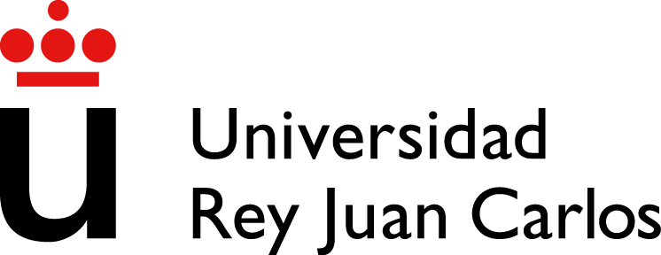

  

  

# SmartRobot FollowLine & IoT

The objective of this practice is to implement a follow line with WiFi communication IoT through MQTT. The kit uses an Arduino Uno and an ESP32 board. For this practice we are using the [*Smart Robot Car Kit V4.0*](https://eu.elegoo.com/products/elegoo-smart-robot-car-kit-v-4-0?gclid=CjwKCAiAhJWsBhAaEiwAmrNyq_3ZPlD2M9mNfQeDcEHBXK67VlbbaKadVQvOGKSp-iyao9TEu_ZG5xoCE9wQAvD_BwE) from [**ELEGOO**](https://eu.elegoo.com/)

The minimum requirements to take into account to carry out the practice are the following:

1. Follow the line as fast as possible without going off.
2. IoT communication via MQTT
3. Serial communication between ESP32 and Arduino UNO
4. If the robot loses the line, it is allowed to search for the line again.
5. Obstacle detection

